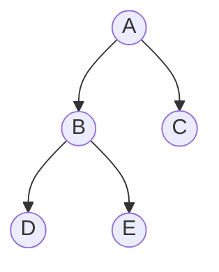
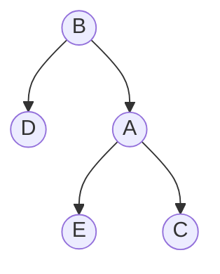

# Balanced Binary Search Tree

### Binary Search Tree
Typical, Binary Search Tree can have a length of `2^n`, even when no of nodes in `n`, as seen in case
of 1,2,3,4,5,6
```txt
  1
   \
    2
     \
      3
       \
        4
         \
          5
           \
            6
```
Search Complexity
- O(log(n)) if very few empty arr items.
- Worst: if n items, we can have arr length = 2^n

Thus complexity = O(n)

Usually, balancing a Binary Search Tree

To balance a tree means height of tree should be minimum as possible (as close to binary heap/binary tree), but still maintaining the tree invariant or property.

## Binary Tree Height
Height of binary tree is number of edges b/w root and furthest leaf
- Height of leaf node = 0 (because no edges)
- Height(node) = Max of [`Left subtree height`, `right subtree height`] + 1
- Height(node) = Max of [`Height(node.left)`, `Height(node.right)` ] + 1
- Find null node height
```txt
leaf node Height = Max of [Height(leaf.left), Height(leaf.right) ] + 1  
leaf node Height = Max of [Height(null), Height(null) ] + 1  
leaf node Height = Height(null) + 1  
0 = Height(null) + 1
Height(null) = -1 <--important
```
- `Height(null) = -1`

> Height of unbalanced 1->2->3->4->5->6 is 5

## Tree Invariant
- Tree invariant is similar to heap invariant, some property which applies to the tree.
- To balance a BST, we cleverly use tree-rotations

## Tree Rotations


Above tree, when rotated right it converts to tree below and if tree below is rotated left it converts to tree above.



## How is works ?
Lets look at first tree,
- node A: B < A & C > A
- node B: D < B & E > B
Thus, order for tree1 is D < B < `E < A` < C

Rotating tree right, should not break this order and if we look at second tree, it does not break the order.

- node B: D < B & A > B
- node A: E < A & C > A
Thus, order for tree2 D < B < `E < A` < C

The order is maintained, as well tree invariant (i.e left is smaller and right is larger) is satisfied.

## How to do right rotation ?

When we rotate right starting at node `A`, left of node `A` will come to top.
Lets start at node `A` in tree1.
pointer1 = node A
pointer2 = node B (A.left)
new left of A is A.left.right or B.right (i.e A left will be E).
Since we took B.right, new B.right will be A itself
Thus following happens
- A.left changes & A.right stays same 
- B.left stays same & B.right changes

```js
const rotateRight = (A) => {
  const B = A.left;
  A.left = B.right;
  B.right = A;
  return B
}
```

## How to do left rotation ?

When we rotate left starting at node `B`, right of node `B` will come to top.
Lets start at node `B` in tree2.
pointer1 = node B
pointer2 = node A (B.right)
new right of B is B.right.left or A.left (i.e B right will be E).
Since we took A.left, new A.left will be B itself
Thus following happens
- B.left stays same & B.right changes
- A.left changes & A.right stays same 

```js
const rotateLeft = (B) => {
  const A = B.right;
  B.right = A.left;
  A.left = B;
  return A
}
```
So, generic rotateLeft & rotateRight will look as follows
```js
const rotateRight = (start) => {
  const node = start.left;
  start.left = node.right;
  node.right = start;
  return node
}

const rotateLeft = (start) => {
  const node = start.right;
  start.right = node.left;
  node.left = start;
  return node
}

const rotate = (start, dir) => {
  const oppDir = dir === "right" ? "left": "right";
  const node = start[opp];
  start[opp] = node[dir];
  node[dir] = start; // a,b reverse
  return node
}
```

## Parent of starting node ?
In tree1, if node `A` has a parent P, after rotation `A` has left child, some right child and P as parent which break binary tree (binary tree nodes have max one parent only). So, we point the Parent P to node `B` now.
This is easily achieved since we return the new node on top from rotate function, parent can now point to returned node.

## Types of BBST
- AVL Tree
- 2-3 Tree
- AA Tree
- Scapegoat Tree
- Red-Black Tree

