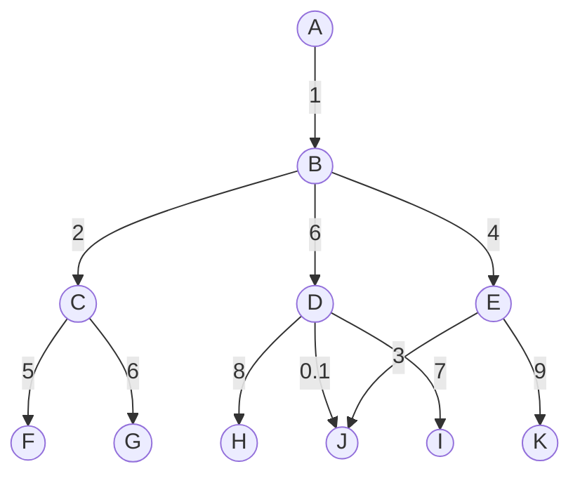

# Dijkstra

Pronounced as dike-struh

- Similar to findPathBFS on graph, but we can have multiple paths, we have to find the smallest.

### Graph#1

## Dijkstra on a Graph#1
- start: A, end: J
- Array1 = dist = [0,......]
- Array2 = nodes = [A=0]
- Array3 = prev = [] // same as BFS findPath

- Start at `A`
  - add all nodes from A
  - dist[B=1]=1
  - add B to nodes ([A=0+seen,B=1])
- Pick from nodes unseen, we picked B
- Start at `B=1`
  - add all nodes from B
  - dist[C=2]=2+1=3
  - dist[D=3]=6+1=7
  - dist[E=4]=4+1=5
  - mark B as seen
  - add C,D,E to nodes ([A=0+seen,B=1+seen,C=3,D=7,E=5])
- Pick from nodes unseen and min value, we picked `C`
- Start at `C=3`
  - add all nodes of C
  - dist[F=5]=5+3=8
  - dist[G=6]=6+3=9
  - mark C as seen
  - add F,G to nodes ([A=0+seen,B=1+seen,C=3+seen,D=7,E=5,F=8,G=9])
- Pick from nodes unseen and min value, we picked `E`
- Start at `E=5`
  - add all nodes of E
  - dist[J=9]=3+5 [END]
  - dist[K=10]=9+5
  - mark E as seen
  - add J,K to nodes ([A=0+seen,B=1+seen,C=3+seen,D=7,E=5+seen,F=8,G=9,J=8,K=14])
  - We have found a path, but that may or may not be smallest
- Pick from nodes unseen and min value, we picked `D`
- Start at `D=7`
  - add all nodes of D
  - dist[H=7]=8+7
  - dist[I=8]=7+7
  - dist[J=9]=0.1+7=7.1 [set earlier as 8], since 7.1 < 8 update J
  - mark D as seen
  - nodes ([A=0+seen,B=1+seen,C=2+seen,D=6+seen,E=4+seen,F=5+seen,G=6,J=3+seen,K=9,H=15,I=14])
- At the end, we check the value of J in prev & dist array.
- dist[J] gives distance of smallest path
- traversing prev[J] gives the path