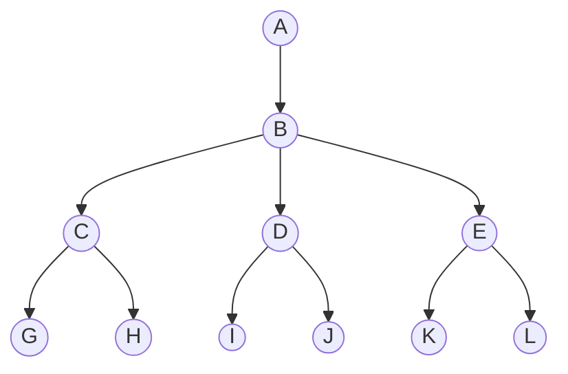
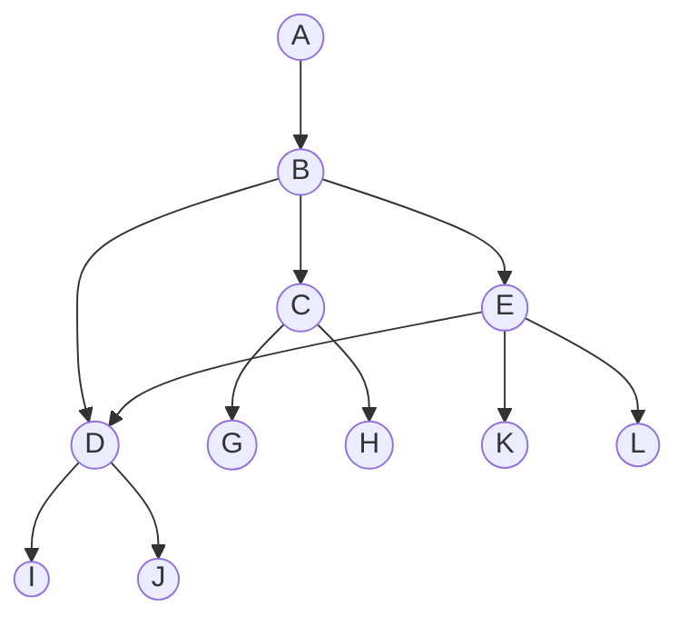

# Graph
Graph is a non-linear data structure consisting of nodes and edges. Edge connects 2 nodes.

We have seen some graph already, like tree, binary search tree, trie,
- Tree is a special type of graph which we do not have cycles, binary trees have at most 2 children, 
- We already have seen traversals for trees (bfs,dfs) and graphs (mazeSolver)


## Types of Graphs
- cyclic: path starting from a node can land back to same node 
- acyclic: !cyclic, tree
- connected: every node connected via some path to another node
- directed: the edges have direction
- un-directed: !directed
- weighted: edges have weights associated with them like maps and routes
- DAG: Directed and Acyclic graph


## How graphs are stored
- First, we should have list of nodes in graph, as array of nodes and their values
- Then, we create another array(Adjacency List) of same size, where each item represents the node connections.
- Nodes=[A,B,C,D]
- AL=[[{to:C},{to:D}],[],[{to:B}],[{to:C}]]
- We can see A points to C & D, B points to nothing, C points to B, D points to C
- If we have weights associated, we can put that also with `to` like `{ to:C, w:20 }`

## Examples of storing graph in javascript
```ts
// connection = { to:number, weight:number }
type Graph = {
  nodes: N[]
  connections: { to: number, weight?: number }[][]
};
const graph = {
  nodes: ["A","B","C","D"],
  connections: [
    [{ to: 1 }], // connections of A
    [{ to: 2 }],  // connections of B
    [], //  // connections of C
    [{ to: 0 }, { to: 1 }], //  // connections of A
  ],
}
```
```ts
// connection = number
type Graph = {
  nodes: N[];
  connections: number[][];
}
const graph = {
  nodes: ["A","B","C","D"],
  connections: [
    [1],
    [2],
    [],
    [0,1],
  ],
}
```
```ts
// storing nodes and connections in single array
type Graph = { node:N, connections: { to:number, weight?:number }[] }[]
const graph = [
  { node: "A", connections: [{ to: 1 }] },
  { node: "B", connections: [{ to: 2 }] },
  { node: "C", connections: [] },
  { node: "D", connections: [{ to: 0 }, { to: 1 }] },
];
```
```ts
// storing nodes and connections in single array
type Graph = { node:N, connections: number[] }[]
const graph = [
  { node: "A", connections: [1] },
  { node: "B", connections: [2] },
  { node: "C", connections: [] },
  { node: "D", connections: [0, 1] },
];
```

## BFS and DFS on graph
- To find a node, simply search nodes array
- To find a path to node from a starting point we have to traverse the graph with BFS or DFS

## BFS/DFS path on graph
The general idea of BFS, DFS stays as we have done for trees(binaryTree etc..), we will use recursion for DFS and queue for BFS.
- We need to keep track of seen nodes since we can return to already seen one (cyclic graphs)


## Important point about path
From a starting point, the path will keep on increasing as we visit more nodes.
- In BFS, the path branches to no of children
- IN DFS, the path branches to direction first

### Graph#1


### BFS on Graph#1
Consider above diagram, here starting at `A` and ends at `L`(search `L`), we have path [`A`]
- then visit B: new path is [`A`,`B`]
- then we have 3 children of `B`: now we 3 new paths
  - path1: [`A`,`B`,`C`]
  - path2: [`A`,`B`,`D`]
  - path3: [`A`,`B`,`E`]
- then C, D, E has 2 children each
  - path1: [`A`,`B`,`C`,`G`]
  - path2: [`A`,`B`,`C`,`H`]
  - path3: [`A`,`B`,`D`,`I`]
  - path4: [`A`,`B`,`D`,`J`]
  - path5: [`A`,`B`,`E`,`K`]
  - path6: [`A`,`B`,`E`,`L`] (found end)

In BFS, we will have  max `n` paths, where n=nodes at a particular level.

### DFS on Graph#1
- DFS works by recursion, whereas the path for each recursion can be shared.

#### DFS on Graph#1 with individual paths
- start at A, path1=[A]
- next is B, path2=[A,B]
- B has 3 children (C,D,E), 
  - explore C: path=[...path2,C]
    - new path=[...path,G] (dead-end)
    - new path=[...path,H] (dead-end)
  - explore D: path=[...path2,D]
    - new path=[...path,I] (dead-end)
    - new path=[...path,J] (dead-end)
  - explore E: path=[...path2,E]
    - new path=[...path,K] (dead-end)
    - new path=[...path,L] (found & return)

#### DFS on Graph#1 with shared path
- Here, we only have one path that can be shared, thus saving some memory
- start at A, path=[A]
- next is B, path=[A,B] (push B)
- B has 3 children (C,D,E), 
  - explore C: path=[A,B,C] (push B)
    - path=[A,B,C,G] (push G, dead-end & pop G)
    - path=[A,B,C,H] (push H, dead-end & pop H)
    - finally, not found pop B
  - explore D: path=[A,B,D] (push D)
    - path=[A,B,D,I] (push I, dead-end & pop I)
    - path=[A,B,D,J] (push J, dead-end & pop J)
    - finally, not found pop D
  - explore E: path=[A,B,E] (push E)
    - path=[A,B,E,K] (push K, dead-end & pop K)
    - path=[A,B,E,L] (push L, found & return)

## Cyclic

In above example, only change in E also points to D.
- E has 3 children, one is D which is already visited
- We need to ignore visited node, else infinite loop